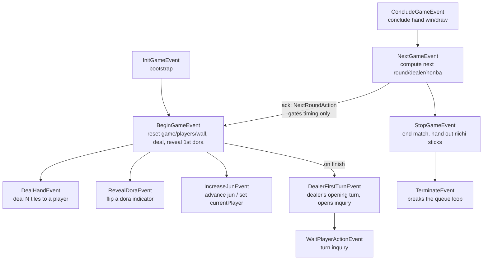
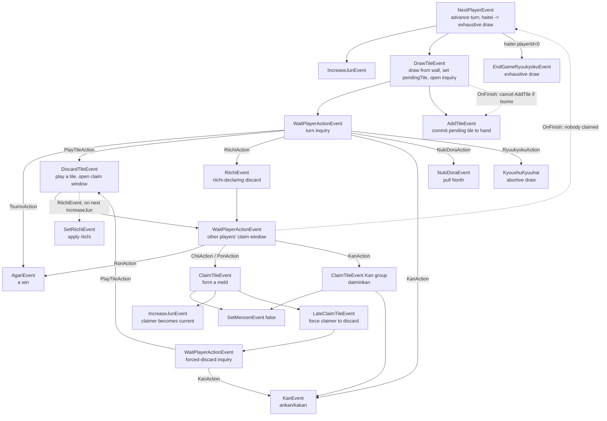
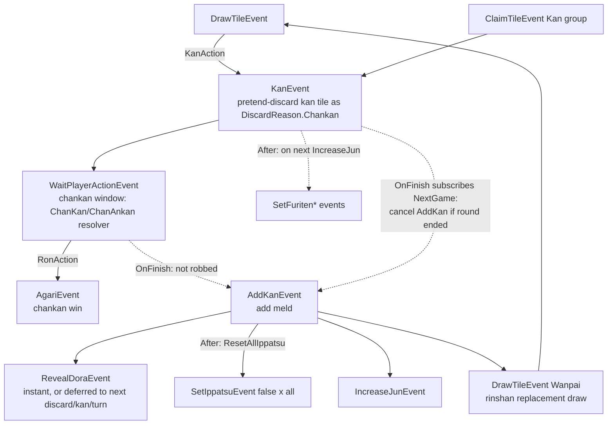
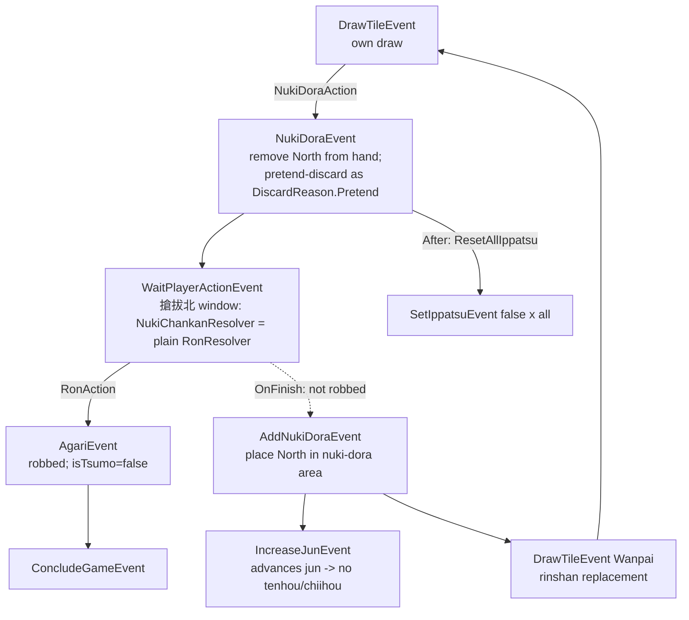
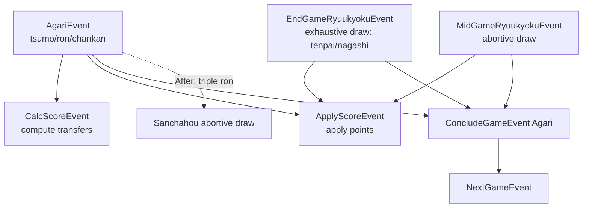

# RabiRiichi In-Game Event Flow (dev reference)

A developer map of the in-game event graph: which event triggers which, what
each event does, and which player **action** gates a transition. Generated from
reading `Events/InGame/**` — cross-check against source when in doubt.

## How the engine drives events

- Events are processed FIFO from an `EventQueue` (`Events/EventQueue.cs`). A
  listener handles an event and may `ev.Q.Queue(...)` more events.
- Player choices happen inside a `WaitPlayerActionEvent`: it presents a
  `MultiPlayerInquiry`, blocks the queue until the player responds (or times
  out), then the chosen action's handler calls `eventBuilder.AddEvent(...)`,
  which is materialized/queued by `WaitPlayerActionListener`. Edges gated this
  way are labelled with the **action** on the arrow.
- Only the highest-priority chosen action(s) fire (e.g. Ron outranks Pon).
- Per-event listener priority bands: `Prepare > Execute > Broadcast > After`.
  Ordering *between queued events* is FIFO; priority only orders listeners of a
  single event.

Legend for the graphs below:
- Solid arrow `A --> B`: event A's listener directly queues event B.
- Labelled arrow `A --|Action|--> B`: B is produced only if a player chooses
  `Action` in A's inquiry window.
- Dashed arrow `A -.->|when| B`: deferred edge — B is armed now but queued later
  (e.g. on the next `IncreaseJunEvent`).

---

## 1. Game / round lifecycle

Notes:
- `NextRoundAction` is an acknowledgment only; `BeginGameEvent` is queued
  unconditionally once all acks/timeout resolve (`NextGameListener`).
- `NextGameEvent` queues `StopGameEvent` instead when an end condition holds
  (round limit, points out of range, etc.).

---

## 2. The turn cycle (draw → act → discard → claim)

Notes:
- The drawing player's `SkipAction` is disabled — they must act.
- After a discard with no claim, `NextPlayerEvent` advances the turn. After a
  chii/pon claim, the claimer discards via `LateClaimTileEvent` (no
  `NextPlayerEvent`; the claimer's `IncreaseJunEvent` set `currentPlayer`).

---

## 3. Kan flow (ankan / kakan / daiminkan)

---

## 4. Nukidora flow (拔北) — VERIFY HERE

Mirrors the kan flow, with these deliberate differences:
- Nuki pretend-discards the North as `DiscardReason.Pretend` (NOT `Chankan`), so
  the robber does **not** get a free 搶槓 yaku — 無役不能搶拔北.
- `AddNukiDoraEvent` does **NOT** reveal a new dora indicator (kan does).
- Both flows draw a rinshan replacement and advance jun; both reset all ippatsu.

### Nukidora invariants to check against the impl

Offer conditions (`Actions/Resolver/NukiDoraResolver.cs`):
- Only on the player's own draw (`incoming.IsTsumo`).
- Only if `DoraOption.Nukidora` is enabled.
- Only if the wall is not haitei AND rinshan is available (nuki needs a
  replacement tile).
- Candidates: in riichi → only the just-drawn North; otherwise hand Norths +
  the drawn North.

Event wiring (`Events/InGame/Listener/NukiDoraListener.cs`,
`DrawTileListener.cs`):
- `NukiDoraAction` → `NukiDoraEvent(playerId, chosen North)`.
- `NukiDoraEvent` opens the rob window; on finish, queues `AddNukiDoraEvent`
  only if no `AgariEvent` was produced (i.e. not robbed).
- `AddNukiDoraEvent` → `IncreaseJunEvent` + `DrawTileEvent(Wanpai)`; no
  `RevealDoraEvent`.
- `NukiDoraEvent` resets all players' ippatsu (`SetIppatsuListener`).

Rob (搶拔北) semantics:
- `NukiChankanResolver` is a plain `RonResolver` (not kokushi-restricted); any
  tenpai player waiting on North may rob, subject to the normal furiten and
  yaku/minHan checks. Since the pretend-discard uses `DiscardReason.Pretend`
  (not `Chankan`), no chankan yaku is granted — so a yakuless waiter cannot rob.

Scoring (`Patterns/NoYaku/NukiDora.cs`, `Dora.cs`, `Uradora.cs`):
- Each North the player controls (pulled aside in `hand.nukiDora` + any North
  left in the winning hand) scores +1 `NukiDora` bonus han.
- When the (ura)dora indicator is West (3z→4z), North also earns regular
  dora/uradora — `Dora`/`Uradora` include `hand.nukiDora`, so pulled North stack
  both bonuses.
- A tsumo on the rinshan replacement counts as `RinshanKaihou`.

Wall (`Core/Wall.cs`):
- With nukidora enabled, `rinshanSize = NUM_RINSHAN + (count of North in
  initialTiles)`, so kans and nukis share an enlarged dead wall and each nuki
  reduces `NumRemaining` by exactly 1.

---

## 5. Win / draw / scoring

Abortive draws (each clears the pending queue then queues its ryuukyoku):
- `SuufonRenda` — four identical winds in first jun (on `NextPlayerEvent`).
- `SuuchaRiichi` — four riichi (on `SetRiichiEvent`).
- `Sanchahou` — triple ron (on `AgariEvent`).
- `SuukanSanra` — four kans by different players (on `IncreaseJunEvent`).
- `KyuushuKyuuhai` — nine terminals/honors first draw (via `RyuukyokuAction`).

---

## 6. State-flag side events (no further triggers)

These apply state and generally don't queue follow-ups:
- `SetRiichiEvent` — apply riichi (checked for `SuuchaRiichi`).
- `SetIppatsuEvent` — set/clear ippatsu. Reset triggers: `IncreaseJunEvent`
  (self), `ClaimTileEvent` (all), `AddKanEvent` (all), `NukiDoraEvent` (all).
- `SetMenzenEvent` — set/clear closed-hand status (queued by `ClaimTileEvent`).
- `SetTempFuritenEvent` / `SetRiichiFuritenEvent` / `SetDiscardFuritenEvent` —
  furiten flags; recomputed (deferred) after discards/kans on the next jun.
- `RevealDoraEvent` — flip a dora indicator.
- `SyncGameStateEvent` — per-player state snapshot (reconnect/sync).
- `EndInquiryEvent` — per-player marker that an inquiry closed.

---

## Quick edge index (event → queued events)

| Event | Queues (→) / action-gated (↦) |
|---|---|
| InitGameEvent | → BeginGameEvent |
| BeginGameEvent | → DealHandEvent×N, RevealDoraEvent, IncreaseJunEvent; →(finish) DealerFirstTurnEvent |
| DealerFirstTurnEvent | → WaitPlayerActionEvent, AddTileEvent |
| NextPlayerEvent | → IncreaseJunEvent, DrawTileEvent (or EndGameRyuukyokuEvent at haitei) |
| DrawTileEvent | → WaitPlayerActionEvent, AddTileEvent; ↦ Tsumo→AgariEvent, PlayTile→DiscardTileEvent, Riichi→RiichiEvent, Kan→KanEvent, NukiDora→NukiDoraEvent, Ryuukyoku→KyuushuKyuuhai |
| DiscardTileEvent / RiichiEvent | → WaitPlayerActionEvent; ↦ Ron→AgariEvent, Chii/Pon→ClaimTileEvent, Kan→ClaimTileEvent(Kan); →(finish, no claim) NextPlayerEvent; ⇢ Riichi→SetRiichiEvent |
| ClaimTileEvent | → SetMenzenEvent; if Kan → KanEvent; else → IncreaseJunEvent, LateClaimTileEvent |
| LateClaimTileEvent | → WaitPlayerActionEvent; ↦ PlayTile→DiscardTileEvent, Kan→KanEvent |
| KanEvent | → WaitPlayerActionEvent; ↦ Ron→AgariEvent; →(finish) AddKanEvent |
| AddKanEvent | → RevealDoraEvent, IncreaseJunEvent, DrawTileEvent(Wanpai); →(After) SetIppatsuEvent(false)×all |
| **NukiDoraEvent** | → WaitPlayerActionEvent; ↦ Ron→AgariEvent; →(finish, not robbed) AddNukiDoraEvent; →(After) SetIppatsuEvent(false)×all |
| **AddNukiDoraEvent** | → IncreaseJunEvent, DrawTileEvent(Wanpai) |
| AgariEvent | → CalcScoreEvent, ApplyScoreEvent, ConcludeGameEvent |
| End/MidGameRyuukyokuEvent | → ApplyScoreEvent, ConcludeGameEvent |
| ConcludeGameEvent | → NextGameEvent |
| NextGameEvent | → BeginGameEvent (via ack) or StopGameEvent |
| StopGameEvent | → TerminateEvent |
